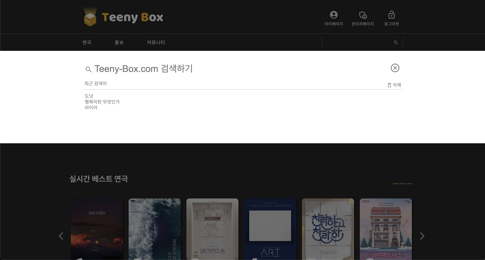
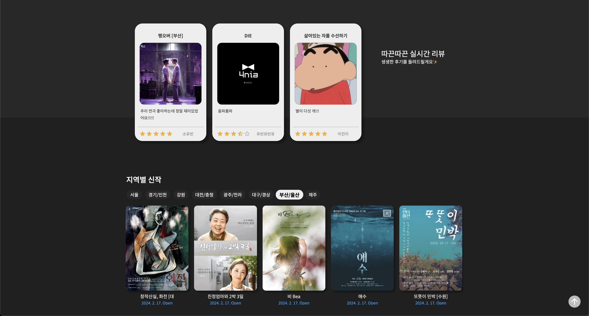
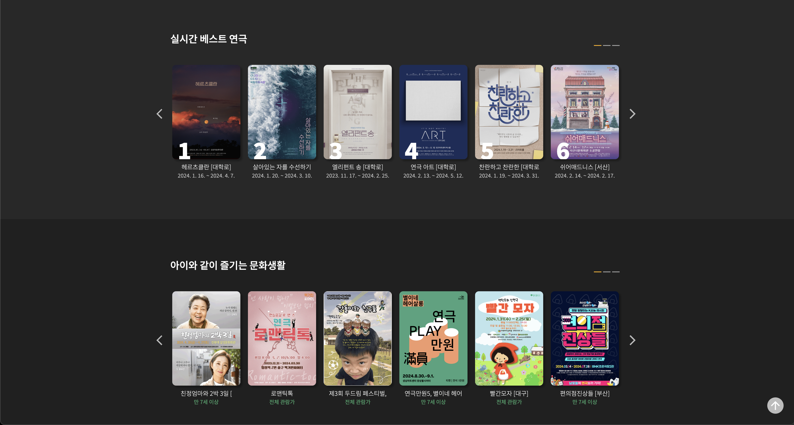
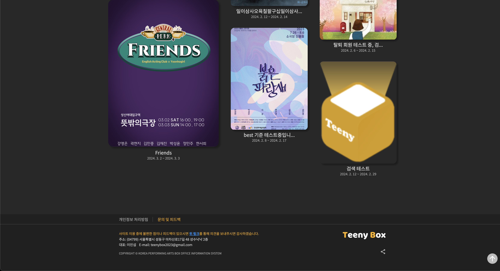
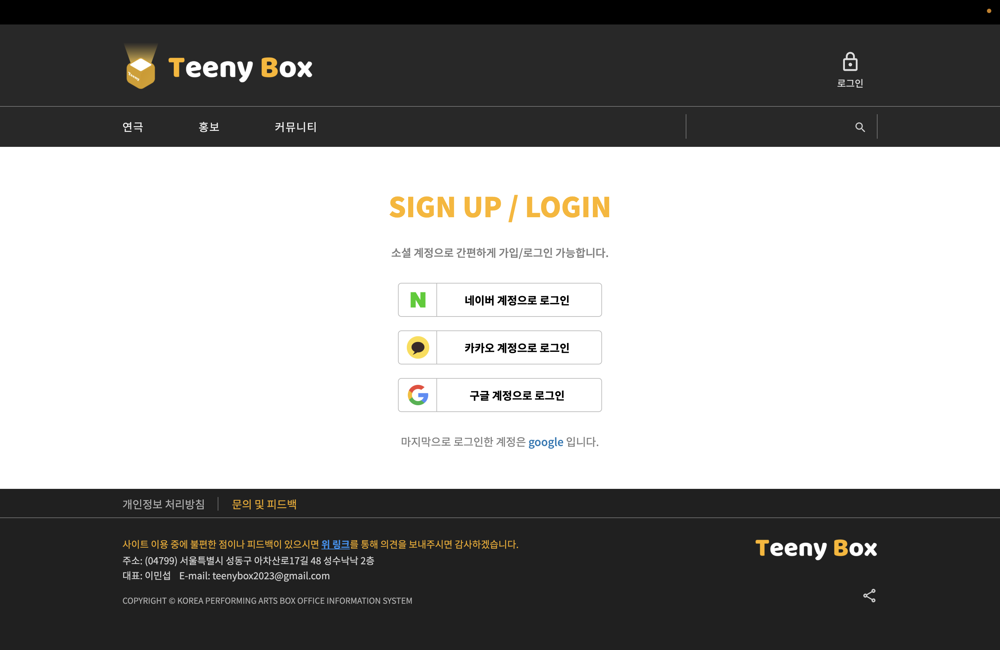
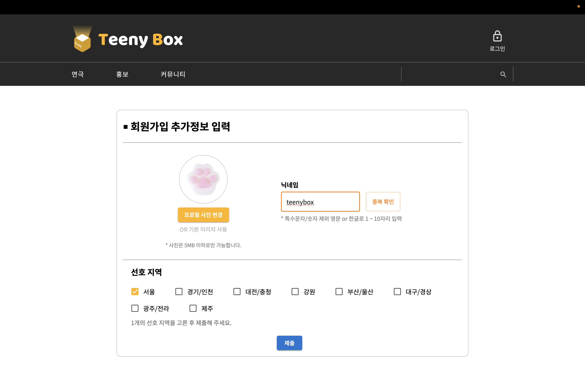
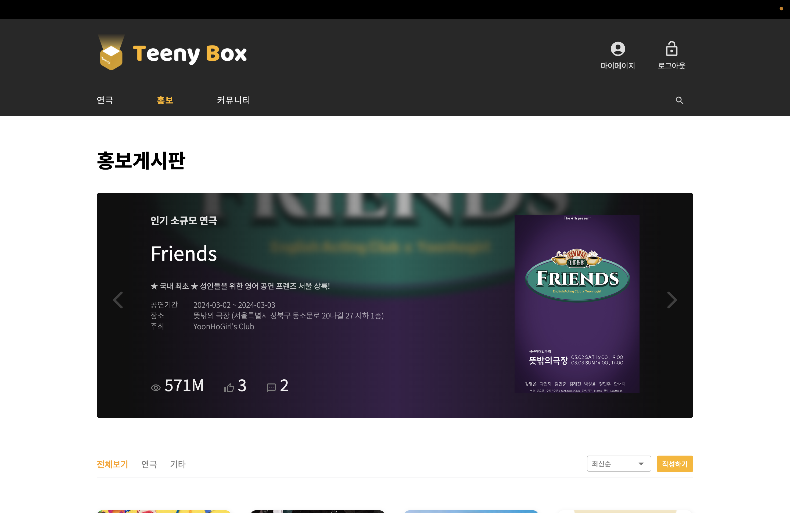
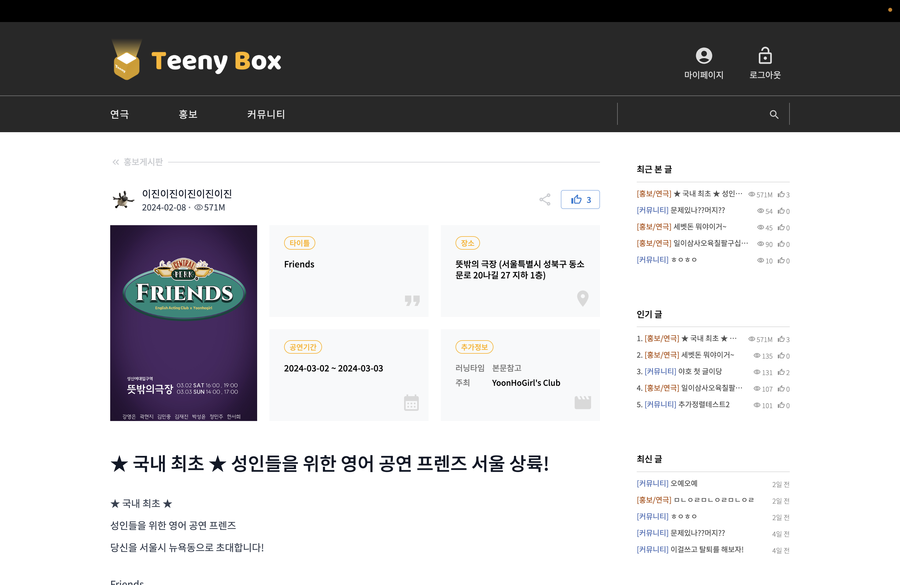
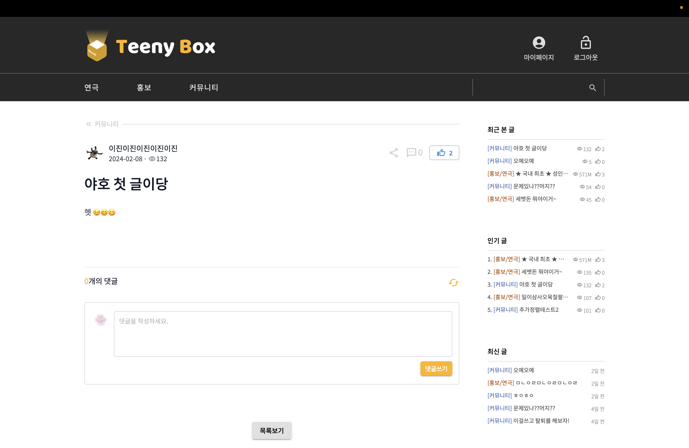
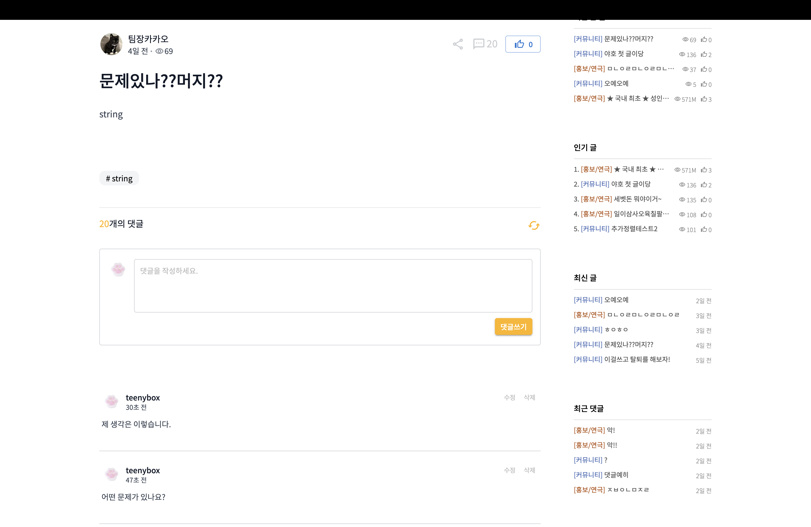

# 🎬 Teeny Box : 연극 정보 공유 서비스


<br/>

다양한 연극 정보를 둘러보고 싶다면❓<br/>
소규모 연극을 홍보하고 싶다면❓<br/>
연극을 좋아하는 사람들과 소통하고 싶다면❓<br/>

### Teeny Box를 방문하세요!

<br/>

## 🌐 서비스 페이지

<b>[https://teeny-box.com](https://teeny-box.com)</b>


(메인 페이지 gif 넣기?)

<br/>

## 🖌️ 기획 / 디자인 / api 문서

- [Figma](https://www.figma.com/file/XuChAzwtMnCB4G2Z5Sk5H3/elice-study-2nd?type=design&node-id=0-1&mode=design&t=Wge6Q0gsllflDcvT-0)
- [Swagger](https://teeny-box.com/api-docs/)

<br/>

## ⚙ 기술 스택

### Front-end
     

### Back-end

  

 <br/>     

### Back-end

<br/>

## 🗂️ 폴더 구조

```
📦
├─ .github
│  └─ workflows
├─ .gitignore
├─ README.md
├─ bin
├─ package-lock.json
├─ package.json
├─ public     # 공통적으로 사용하는 리소스 (사진 등)
└─ src
   ├─ App.js
   ├─ App.scss
   ├─ AppRoutes.jsx     # 애플리케이션 라우팅 설정
   ├─ apis     # api url 모음
   ├─ assets     # 특정 컴포넌트에서 쓰이는 리소스 (사진 등)
   ├─ components     # 페이지 컴포넌트에 쓰이는 컴포넌트
   │  ├─ admin
   │  ├─ board-free
   │  ├─ board-pr
   │  ├─ board
   │  ├─ common
   │  ├─ main
   │  ├─ mypage
   │  ├─ play-detail
   ├─ hooks     # 커스텀 훅
   ├─ index.css
   ├─ index.js
   ├─ pages     # 페이지 컴포넌트
   │  ├─ admin
   │  ├─ common
   │  ├─ errorPage
   │  ├─ free-board
   │  ├─ index.jsx
   │  ├─ main
   │  ├─ mypage
   │  ├─ play-detail
   │  ├─ play-list
   │  ├─ pr-board
   │  ├─ redirection
   │  ├─ search-result
   │  ├─ user
   │  └─ util
   └─ utils     # 공통적으로 사용될 수 있는 기능(js 파일)
```

<br/>

## ✔️ 주요 기능

|    |    |   |
| --- | --- | --- |
| **메인페이지** |  <br/> 검색창을 통해 찾고자 하는 연극이나 게시물을 검색할 수 있습니다. <br/>  <br/>회원분들의 실시간 리뷰나 지역별 신작을 확인할 수 있습니다. |  <br/> 슬라이드를 넘기며 원하는 연극을 고르고 클릭 시  연극 상세페이지로 이동 힐 수 있습니다. <br/>인기 소규모 연극을 볼 수 있고, 푸터에서는 피드백을 받을 수 있는 구글 폼으로 이동이 가능합니다. |
| **회원가입/로그인** |  <br/>카카오, 네이버, 구글 등 소셜로그인을 통해 간편하게 로그인할 수 있습니다. |  <br/> 소셜로그인 후 프로필사진, 닉네임, 선호지역 등의 간단한 추가 정보를 입력하여 복잡한 절차 없이 회원가입할 수 있습니다. |
| **연극 리스트 페이지** | |
| **연극 디테일 페이지** | |
| **홍보 게시판** | 사용자들은 다양한 연극 정보를 쉽게 접할 수 있고, 연극 제작진과 지인들은 자신의 작품이나 관심 있는 연극 작품을 홍보할 수 있습니다. <br/> |
| **홍보 게시글 작성** | 각 지역의 연극 정보를 자세하게 작성하여 연극 홍보를 할 수 있는 서비스를 제공합니다. <br/> |
| **커뮤니티** | 연극이나 배우 등의 정보를 공유하고 자신의 경험을 나누는 등 자유롭게 소통할 수 있는 공간을 제공합니다. <br/> |
| **커뮤니티 게시글 작성** | 사용자들은 자신의 생각이나 경험을 공유하기 위해 커뮤니티에 게시글을 작성할 수 있습니다. <br/> |
| **댓글** | 게시글에 댓글을 작성하여 다른 사용자들과 의견을 공유하고 소통할 수 있습니다. <br/> |
| **마이 페이지** | |
| **관리자 페이지** | |

<br/>

## 💻 팀원 소개

<table>
    <tr align="center">
        <td><B>Leader / Backend<B></td>
        <td><B>Backend<B></td>
        <td><B>Backend<B></td>
        <td><B>Frontend<B></td>
        <td><B>Frontend<B></td>
        <td><B>Frontend<B></td>
    </tr>
    <tr align="center">
        <td><B>이민섭<B></td>
        <td><B>허은리<B></td>
        <td><B>김동현<B></td>
        <td><B>이진이<B></td>
        <td><B>김성재<B></td>
        <td><B>소유빈<B></td>
    </tr>
    <tr align="center">
        <td>
            
            <br>
            <a href="https://github.com/lms990108"><I>lms990108</I></a>
        </td>
        <td>
            
            <br>
            <a href="https://github.com/eunli"><I>eunli</I></a>
        </td>
        <td>
            
            <br>
            <a href="https://github.com/dongjangoon"><I>dongjangoon</I></a>
        </td>
        <td>
            
            <br>
            <a href="https://github.com/jin-dooly"><I>jin-dooly</I></a>
        </td>
        <td>
            
            <br>
            <a href="https://github.com/JMTcord"><I>JMTcord</I></a>
        </td>
        <td>
            
            <br>
            <a href="https://github.com/kanujoa"><I>kanujoa</I></a>
        </td>
    </tr>
</table>
