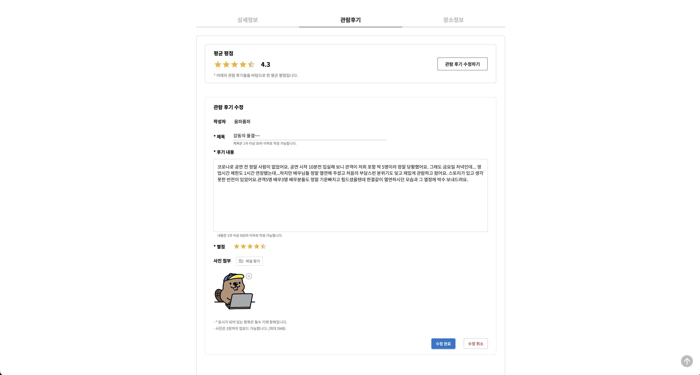

# 🎬 Teeny Box : 연극 정보 공유 서비스


<br/>

다양한 연극 정보를 둘러보고 싶다면❓<br/>
소규모 연극을 홍보하고 싶다면❓<br/>
연극을 좋아하는 사람들과 소통하고 싶다면❓<br/>

### Teeny Box를 방문하세요!

<br/>

## 🌐 서비스 페이지

<b>[https://teeny-box.com](https://teeny-box.com)</b>


(메인 페이지 gif 넣기?)

<br/>

## 🖌️ 기획 / 디자인 / api 문서

- [Figma](https://www.figma.com/file/XuChAzwtMnCB4G2Z5Sk5H3/elice-study-2nd?type=design&node-id=0-1&mode=design&t=Wge6Q0gsllflDcvT-0)
- [Swagger](https://teeny-box.com/api-docs/)

<br/>

## 📄 스토리보드


<br/>

## 🛠 기술 스택

### Front-end

     

### Back-end

  

 <br/>     

<br/>

## ⚙ 아키텍쳐


<br/>

## 🗂️ 폴더 구조

```
📦
├─ .github
│  └─ workflows
├─ .gitignore
├─ README.md
├─ bin
├─ package-lock.json
├─ package.json
├─ public     # 공통적으로 사용하는 리소스 (사진 등)
└─ src
   ├─ App.js
   ├─ App.scss
   ├─ AppRoutes.jsx     # 애플리케이션 라우팅 설정
   ├─ apis     # api url 모음
   ├─ assets     # 특정 컴포넌트에서 쓰이는 리소스 (사진 등)
   ├─ components     # 페이지 컴포넌트에 쓰이는 컴포넌트
   │  ├─ admin
   │  ├─ board-free
   │  ├─ board-pr
   │  ├─ board
   │  ├─ common
   │  ├─ main
   │  ├─ mypage
   │  ├─ play-detail
   ├─ hooks     # 커스텀 훅
   ├─ index.css
   ├─ index.js
   ├─ pages     # 페이지 컴포넌트
   │  ├─ admin
   │  ├─ common
   │  ├─ errorPage
   │  ├─ free-board
   │  ├─ index.jsx
   │  ├─ main
   │  ├─ mypage
   │  ├─ play-detail
   │  ├─ play-list
   │  ├─ pr-board
   │  ├─ redirection
   │  ├─ search-result
   │  ├─ user
   │  └─ util
   └─ utils     # 공통적으로 사용될 수 있는 기능(js 파일)
```

<br/>

## ✔️ 주요 기능

|                                                                                                                                                                                                                          |
| ------------------------------------------------------------------------------------------------------------------------------------------------------------------------------------------------------------------------ |
| **메인페이지**                                                                                                                                                                                                           |
|  <br/> 검색창을 통해 연극과 게시물을 검색할 수 있습니다.                                                                                                                   |
|  <br/> 슬라이드를 넘기면서 연극을 선택하고 클릭하면 연극 상세페이지로 이동할 수 있습니다.                                                                                  |
|  <br/> 회원분들의 실시간 리뷰와 지역별 신작을 확인할 수 있습니다.                                                                                                          |
|  <br/> 인기 소규모 연극을 볼 수 있으며, 푸터에서는 피드백을 받을 수 있는 구글 폼으로 이동할 수 있습니다.                                                                   |
| **회원가입/로그인**                                                                                                                                                                                                      |
|  <br/> 카카오, 네이버, 구글 등 소셜로그인을 통해 간편하게 로그인할 수 있습니다.                                                                                            |
|  <br/> 소셜로그인 후 프로필사진, 닉네임, 선호지역 등의 간단한 추가 정보를 입력하여 복잡한 절차 없이 회원가입할 수 있습니다.                                             |
| **연극 리스트 페이지**                                                                                                                                                                                                   |
|  <br/> 여러 조건을 설정하여 원하는 연극 리스트를 볼 수 있습니다.                                                                                                           |
|  <br/> 외부 API로부터 가져온 연극 목록을 리스트로 표시하고, 페이지 네이션을 통해 사용자에게 보여줍니다.                                                                    |
| **연극 디테일 페이지**                                                                                                                                                                                                   |
|  <br/> 해당 연극의 정보를 확인할 수 있고 공유, 찜, 예매사이트로 이동이 가능 합니다.                                                                                        |
|  <br/> 회원분들의 후기를 확인할 수 있습니다.                                                                                                                               |
|  <br/> 자신의 후기를 사진과 함께 올릴 수 있고 평점을 줄 수 있습니다.                                                                                                       |
| **홍보**                                                                                                                                                                                                                 |
|  <br/> 홍보 게시판으로 사용자들은 다양한 연극 정보를 쉽게 접할 수 있고, 연극 제작진과 지인들은 플랫폼을 통해 자신의 작품이나 관심 있는 연극 작품을 홍보할 수 있습니다. |
| **홍보 게시글 작성**                                                                                                                                                                                                     |
|  <br/> 각 지역의 연극 정보(장소, 공연 기간, 기타 정보 등)를 자세하게 작성하여 연극 홍보를 할 수 있는 서비스를 제공합니다.                                             |
|                                                                                                                                                                                                                          |
| **커뮤니티**                                                                                                                                                                                                             |
|  <br/> 연극이나 배우 등의 정보를 공유하고 자신의 경험을 나누는 등 자유롭게 소통할 수 있는 공간을 제공합니다.                                                                |
|                                                                                                                                                                                                                          |
| **커뮤니티 게시글 작성**                                                                                                                                                                                                 |
|  <br/> 사용자들은 자신의 생각이나 경험을 공유하기 위해 커뮤니티에 게시글을 작성할 수 있습니다.                                                                             |
|                                                                                                                                                                                                                          |
| **댓글**                                                                                                                                                                                                                 |
|  <br/> 게시글에 댓글을 작성하여 다른 사용자들과 의견을 공유하고 소통할 수 있어 더욱 활발한 커뮤니케이션이 이뤄질 수 있습니다.                                            |
| **마이 페이지**                                                                                                                                                                                                          |
|  <br/> 회원 정보를 확인하고 수정할 수 있으며, 필요할 경우 탈퇴도 가능합니다.                                                                                             |
|  <br/> 사용자가 찜한 연극 목록을 확인할 수 있습니다.                                                                                                                     |
|  <br/> 사용자가 작성한 리뷰, 게시글, 댓글 등을 모두 확인하고 선택하여 삭제할 수 있습니다.                                                                                |
| **관리자 페이지**                                                                                                                                                                                                        |
|  <br/> 조회한 회원 정보나 후기, 게시글, 댓글을 원하는 경우 선택하여 삭제할 수 있습니다.                                                                                   |
|  <br/> 조회한 회원 정보나 후기, 게시글, 댓글을 원할 시 선택하여 삭제 가능합니다.                                                                                        |

<br/>

## 🚀 트러블 슈팅

### 1. 연극 get api 사용 시 응답 시간 문제

- <b>문제</b>

  - 개발 초기에는 메인 페이지(/)와 연극 리스트 페이지(/play)에서 연극 get api 사용 시 모든 연극들을 한꺼번에 다 가져와 프론트에서 필터링과 페이지네이션을 진행하였음.
  - but 연극 데이터 구조가 좀 더 복잡해지면서 모든 연극을 한꺼번에 가져올 때 걸리는 시간이 매우 증가하게 됨. (ms가 아닌 s 단위로 증가)
    

- <b>해결</b>
  - 서버 측에서 서버에 요청 url로 전달되는 쿼리 파라미터를 통해 연극 필터링과 페이지네이션을 거쳐 클라이언트로 응답 전달이 가능하도록 수정함.
  - 프론트엔드 측에서도 요청을 보낼 때 쿼리 파라미터로 필터링, 페이지네이션 조건을 넣어 현재 상태에서 필요한 데이터만 받을 수 있도록 코드 수정
  - 결과적으로 응답 시간 단축 (약 62ms)
    

<br/>

### 2. 현재 로그인된 유저 정보 저장 문제

- <b>문제</b>
  - 초반에는 로그인된 유저 정보 중에서도 자주 사용될 가능성이 있는 닉네임, 프로필 사진 url 등의 정보를 로그인 성공 시점에 로컬스토리지에 저장시키는 방식을 사용함.
  - but 로컬스토리지에 저장하게 되면 유저 정보가 사용자게에 직접적으로 드러나게 되고, 사용자가 로컬스토리지를 비우는 등 직접 조작할 가능성이 있기 때문에 안정적이지 않다고 생각하였음.
- <b>해결</b>
  - 전역 상태 라이브러리를 사용하지 않고 프로젝트를 진행하였기 때문에 로그인 성공시 App.js에 정의해 둔 userData라는 state에 유저 정보가 저장되게 하였고, Context API를 이용해 모든 컴포넌트에서 유저 정보를 이용 가능하게 함.

<br/>

## 💻 팀원 소개

<table>
    <tr align="center">
        <td><B>Leader / Backend<B></td>
        <td><B>Backend<B></td>
        <td><B>Backend<B></td>
        <td><B>Frontend<B></td>
        <td><B>Frontend<B></td>
        <td><B>Frontend<B></td>
    </tr>
    <tr align="center">
        <td><B>이민섭<B></td>
        <td><B>허은리<B></td>
        <td><B>김동현<B></td>
        <td><B>이진이<B></td>
        <td><B>김성재<B></td>
        <td><B>소유빈<B></td>
    </tr>
    <tr align="center">
        <td>
            
            <br>
            <a href="https://github.com/lms990108"><I>lms990108</I></a>
        </td>
        <td>
            
            <br>
            <a href="https://github.com/eunli"><I>eunli</I></a>
        </td>
        <td>
            
            <br>
            <a href="https://github.com/dongjangoon"><I>dongjangoon</I></a>
        </td>
        <td>
            
            <br>
            <a href="https://github.com/jin-dooly"><I>jin-dooly</I></a>
        </td>
        <td>
            
            <br>
            <a href="https://github.com/JMTcord"><I>JMTcord</I></a>
        </td>
        <td>
            
            <br>
            <a href="https://github.com/kanujoa"><I>kanujoa</I></a>
        </td>
    </tr>
</table>
